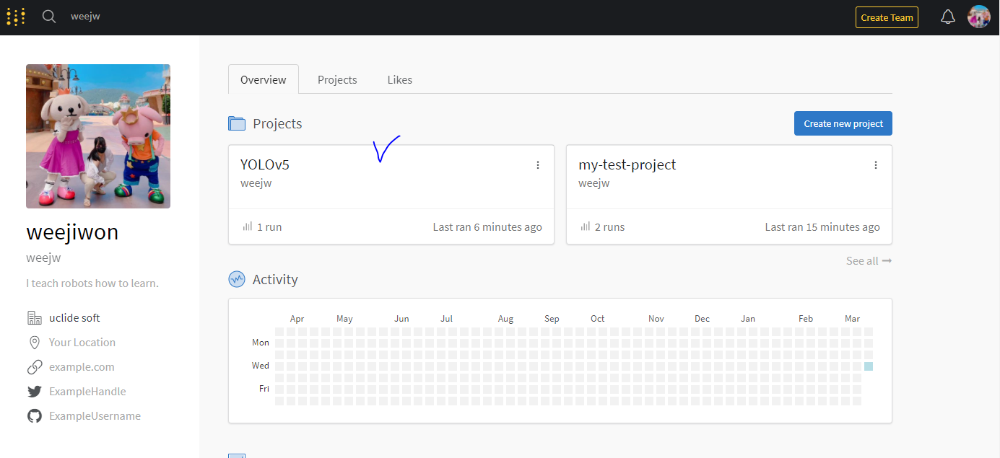

구축 환경: ubuntu on windows

[https://github.com/ultralytics/yolov5/wiki](https://github.com/ultralytics/yolov5/wiki) 에 가이드가 잘되어있기 때문에 따라하면 될 듯하다 :)

## 설치 및 환경 설정하기
 1. 콘다 설치<br>
  [Installing on Linux](https://docs.anaconda.com/anaconda/install/linux/) 페이지를 참고하여 설치

 2. 가상환경 생성
```shell
$ conda create -n yolov5_env python=3.8
$ conda activate yolov5_env
```

3. yolov5 깃헙 클론 및 requirement 설치
```shell
$  git clone https://github.com/ultralytics/yolov5.git
$  pip install -r requirements.txt
```

4. wandb 설치
시각화를 위해 사용한다. 아래 명령어로 설치 가능하다. 
```shell
pip install wandb
```

설치한 이후에는 [wandb 홈페이지](https://wandb.ai/site?utm_campaign=repo_yolo_traintutorial) 를 통해 가입해준다.<br>
가입한 후 사용법은 [https://wandb.ai/quickstart/pytorch](https://wandb.ai/quickstart/pytorch) 에 자세하게 적혀있다.
문제없이 테스트가 완료되었다 :)


6. 학습해보기
```shell
# Train YOLOv5s on COCO128 for 3 epochs
$ python train.py --img 640 --batch 16 --epochs 3 --data coco128.yaml --weights yolov5s.pt
```

7. 결과 확인

wandb에 들어가면 아래처럼 새로운 프로젝트가 생성된걸 확인할 수 있다. 이를 눌러 들어가보면 결과가 짜자잔~ 우왕 짱이닷!!


## REFERENCES
- [https://settembre.tistory.com/459](https://settembre.tistory.com/459)
- [https://dambi-ml.tistory.com/6](https://dambi-ml.tistory.com/6)
- [https://89douner.tistory.com/313](https://89douner.tistory.com/313)
